# HTML to Image Service

A PrimeForge tools set.

Self-hosted API for rendering **HTML/CSS** (or a whitelisted URL, or a Handlebars template) into **PNG/JPEG/WebP**. 

## Features

- **Multiple input sources**: HTML, Templates, or whitelisted URLs
- **Presets**: Size and crop presets; Handlebars HTML templates
- **High quality**: Configurable DPR (device pixel ratio) for crisp images
- **Development mode**: Template hot-reloading in development environment
- **Preview UI**: Interactive preview interface at `/preview`
- **Security-first**: URL allowlist, input validation, sandboxed rendering
- **Production-ready**: Docker support with multilingual fonts

## Available Templates

### 1. simple-card
A clean, minimalist card design suitable for social media sharing.

### 2. rednote-dark  
Dark theme template with gradient backgrounds, perfect for tech/AI content.

### 3. rednote-light
Light theme template with clean aesthetics, ideal for professional content.

## Quick Start

### Installation

```bash
npm install
```

### Development

```bash
npm run dev
# Server runs on http://localhost:3515
# Templates auto-reload on changes (no restart needed)
```

### Production

```bash
npm start
# Server runs on http://localhost:3000
# Templates are cached for performance
```

## API Usage

### Basic Example

```bash
curl -X POST http://localhost:3000/render \
  -H "Content-Type: application/json" \
  -d '{
    "templateName": "simple-card",
    "templateData": { 
      "badge": "SECURE", 
      "title": "Hello, Nick", 
      "subtitle": "Rendered by Playwright", 
      "bg": "#0b1021",
      "color": "#fff" 
    },
    "format": "png"
  }' \
  --output image.png
```

### Using Direct HTML

```bash
curl -X POST http://localhost:3000/render \
  -H "Content-Type: application/json" \
  -d '{
    "html": "<h1>Hello World</h1>",
    "css": "h1 { color: blue; }",
    "width": 800,
    "height": 400
  }' \
  --output image.png
```

## API Endpoints

### `POST /render`

Renders content to an image.

**Request Schema:**

```json
{
  "templateName": "simple-card",
  "templateData": { "title": "Hello" },
  "html": "<html>...</html>",
  "url": "https://example.com",
  "css": "body { font-size: 16px; }",
  "width": 1200,
  "height": 630,
  "sizePreset": "twitter_card",
  "clipPreset": "top_banner",
  "clip": { "x": 0, "y": 0, "width": 800, "height": 200 },
  "dpr": 2,
  "format": "png|jpeg|webp",
  "quality": 90,
  "fullPage": false,
  "omitBackground": false,
  "waitUntil": "load|domcontentloaded|networkidle",
  "waitFor": 1000,
  "timeout": 15000
}
```

> Provide **one of** `html` | `templateName` | `url`.

**Parameters:**

- **Input** (choose one):
  - `html` - Direct HTML string
  - `templateName` + `templateData` - Template with data
  - `url` - URL to render (requires whitelist)

- **Size** (optional):
  - `width`/`height` - Custom dimensions
  - `sizePreset` - Predefined sizes
  - `clipPreset` - Crop region presets
  - `clip` - Custom crop region

- **Rendering**:
  - `css` - Additional CSS to inject
  - `dpr` - Device pixel ratio (default: 2)
  - `format` - Output format: png (default), jpeg, webp
  - `quality` - JPEG/WebP quality (1-100, default: 90)
  - `fullPage` - Capture full scrollable page
  - `omitBackground` - Transparent background (PNG only)

- **Timing**:
  - `waitUntil` - When to consider page ready
  - `waitFor` - Additional wait time in ms
  - `timeout` - Maximum timeout in ms

### `GET /preview`

Interactive preview interface for testing templates and settings.

### `GET /presets`

Returns available size and clip presets.

### `GET /template/:name`

Renders a template with test data (HTML response).

### `GET /healthz`

Health check endpoint. Returns `{ ok: true }`.

## Configuration

### Environment Variables

```bash
PORT=3000                      # Server port
NODE_ENV=development          # Enable hot-reloading for templates
DEFAULT_DPR=2                 # Default device pixel ratio
ALLOW_URL=false              # Enable URL rendering
URL_ALLOWLIST=example.com    # Comma-separated domain whitelist
BLOCK_EXTERNAL=true          # Block external network requests
MAX_WIDTH=10000              # Maximum width limit
MAX_HEIGHT=10000             # Maximum height limit
MAX_PIXELS=100000000         # Maximum total pixels
TEMPLATES_DIR=/app/templates # Templates directory path
PRESETS_PATH=/app/templates/presets/presets.json # Presets config path
```

### Size Presets

Available in `templates/presets/presets.json`:

- `twitter_card` - 1200×630 (Twitter/X cards)
- `square_1080` - 1080×1080 (Instagram posts)
- `story_1080x1920` - 1080×1920 (Instagram/TikTok stories)
- `banner_1920x480` - 1920×480 (Website banners)
- `rednote_1080x1440` - 1080×1440 (RedNote vertical)
- `rednote_1080x1080` - 1080×1080 (RedNote square)

### Template Development

Templates are Handlebars files in `templates/html/*.hbs`:

```handlebars
<!DOCTYPE html>
<html>
<head>
    <style>
        h1 { color: {{color}}; }
    </style>
</head>
<body>
    <h1>{{title}}</h1>
    {{#if subtitle}}
    <h2>{{subtitle}}</h2>
    {{/if}}
    <div>{{{content}}}</div>
</body>
</html>
```

Available Handlebars variables depend on the template design.

## Docker Deployment

### Using Docker Compose

```yaml
version: '3.8'
services:
  html-to-image:
    build: .
    ports:
      - "3000:3000"
    environment:
      - PORT=3000
      - NODE_ENV=production
      - DEFAULT_DPR=2
      - BLOCK_EXTERNAL=true
      - ALLOW_URL=false
      - TEMPLATES_DIR=/app/templates
      - PRESETS_PATH=/app/templates/presets/presets.json
    volumes:
      - ./templates:/app/templates
```

### Building and Running

```bash
# Build
docker build -t html-to-image .

# Run
docker run -p 3000:3000 \
  -e NODE_ENV=production \
  -e DEFAULT_DPR=2 \
  html-to-image
```

## Font Support

The Docker image includes:
- Noto fonts (including CJK for Asian languages)
- Noto Color Emoji
- Liberation fonts

For custom fonts, add them to the `fonts/` directory and rebuild:

```dockerfile
COPY ./fonts /usr/share/fonts/custom
RUN fc-cache -f -v
```

## Technical Architecture

### Rendering Process Flow

The following flowchart illustrates the technical implementation of how text/HTML is rendered to images using the headless browser:

```mermaid
flowchart TD
    Start([Client Request<br/>POST /render]) --> Validate{Validate Input<br/>Zod Schema}
    
    Validate -->|Invalid| Error1[Return 400 Error]
    Validate -->|Valid| CheckInput{Check Input Type}
    
    CheckInput -->|Template| LoadTemplate[Load Handlebars Template<br/>from templates/html/*.hbs]
    CheckInput -->|HTML| UseHTML[Use Direct HTML]
    CheckInput -->|URL| CheckURL{URL Allowed?}
    
    CheckURL -->|No| Error2[Return Error:<br/>URL not allowed]
    CheckURL -->|Yes| CheckWhitelist{Domain in<br/>Whitelist?}
    CheckWhitelist -->|No| Error3[Return Error:<br/>Domain not whitelisted]
    CheckWhitelist -->|Yes| UseURL[Use External URL]
    
    LoadTemplate --> CompileTemplate[Compile Template<br/>with Data]
    CompileTemplate --> GenerateHTML[Generate HTML String]
    
    GenerateHTML --> ApplyCSS{CSS Provided?}
    UseHTML --> ApplyCSS
    UseURL --> GetBrowser
    
    ApplyCSS -->|Yes| InjectCSS[Inject CSS into<br/>head tag]
    ApplyCSS -->|No| GetBrowser
    InjectCSS --> GetBrowser
    
    GetBrowser[Get/Create Browser Instance<br/>Chromium via Playwright]
    GetBrowser --> CreateContext[Create Browser Context<br/>- Set deviceScaleFactor<br/>- Configure viewport<br/>- Setup network control]
    
    CreateContext --> NetworkControl{Block External<br/>Resources?}
    NetworkControl -->|Yes| RouteNetwork[Route Network:<br/>Block non-data/blob URLs<br/>except whitelisted]
    NetworkControl -->|No| CreatePage
    RouteNetwork --> CreatePage
    
    CreatePage[Create New Page] --> SetViewport[Set Viewport Size<br/>Width × Height]
    SetViewport --> LoadContent{Content Type}
    
    LoadContent -->|HTML/Template| SetContent[page.setContent<br/>Load HTML into page]
    LoadContent -->|URL| Navigate[page.goto<br/>Navigate to URL]
    
    SetContent --> WaitReady[Wait Until Ready<br/>- load<br/>- domcontentloaded<br/>- networkidle]
    Navigate --> WaitReady
    
    WaitReady --> WaitExtra{Additional<br/>Wait?}
    WaitExtra -->|Timeout| WaitTimeout[Wait for X ms]
    WaitExtra -->|Selector| WaitSelector[Wait for CSS Selector]
    WaitExtra -->|No| SetDPR
    
    WaitTimeout --> SetDPR
    WaitSelector --> SetDPR
    
    SetDPR[Set Device Pixel Ratio<br/>Override window.devicePixelRatio]
    SetDPR --> ConfigShot[Configure Screenshot Options<br/>- Format: png/jpeg/webp<br/>- Quality<br/>- Full page<br/>- Background<br/>- Clip region]
    
    ConfigShot --> TakeShot[page.screenshot<br/>Capture Image]
    TakeShot --> CleanupPage[Close Page & Context]
    
    CleanupPage --> ReturnImage[Return Image Buffer<br/>with Content-Type header]
    
    ReturnImage --> End([Image Response<br/>to Client])
    
    style Start fill:#e1f5e1
    style End fill:#e1f5e1
    style Error1 fill:#ffe1e1
    style Error2 fill:#ffe1e1
    style Error3 fill:#ffe1e1
    style GetBrowser fill:#e1e5ff
    style TakeShot fill:#fff3e1
```



### Key Implementation Details

1. **Browser Lifecycle Management**:
   - Singleton browser instance persists across requests
   - Automatic reconnection if browser disconnects
   - Retry logic (3 attempts) for browser errors
   - Graceful shutdown on SIGTERM

2. **Security Layers**:
   - Input validation with Zod schemas
   - URL allowlist enforcement
   - Network request blocking for external resources
   - Sandboxed page contexts (isolated per request)
   - Size limits to prevent resource exhaustion

3. **Performance Optimizations**:
   - Template caching in production mode
   - Hot-reloading in development mode
   - Configurable DPR for quality vs speed tradeoff
   - Browser instance reuse across requests

4. **Error Handling**:
   - Comprehensive error catching at each stage
   - Automatic browser restart on crashes
   - Detailed error logging with Pino
   - Client-friendly error messages

## Security

- URL rendering is disabled by default
- When enabled, only whitelisted domains are allowed
- Templates are sandboxed and rendered in isolated browser contexts
- Input validation using Zod schemas
- External network requests can be blocked via `BLOCK_EXTERNAL`
- Size limits prevent resource exhaustion

### Recommended Production Settings

```bash
BLOCK_EXTERNAL=true    # Block external requests
ALLOW_URL=false       # Disable URL rendering
MAX_WIDTH=5000        # Reasonable limits
MAX_HEIGHT=5000
MAX_PIXELS=25000000
```

## n8n Integration

Use the HTTP Request node:

```json
{
  "method": "POST",
  "url": "http://html-to-image:3000/render",
  "headers": {
    "Content-Type": "application/json"
  },
  "body": {
    "templateName": "simple-card",
    "templateData": {
      "title": "{{$json.title}}",
      "subtitle": "{{$json.subtitle}}"
    },
    "sizePreset": "twitter_card",
    "format": "png"
  },
  "responseFormat": "file"
}
```

## Troubleshooting

### Templates not updating
- Check `NODE_ENV=development` for hot-reloading
- In production, templates are cached - restart required

### Chinese/Emoji rendering issues
- Ensure fonts are installed (see Font Support section)
- Run `fc-cache -f -v` to refresh font cache

### Performance optimization
- Use `dpr: 1` for faster rendering if high quality not needed
- Enable template caching in production
- Consider implementing CDN for generated images

### Memory issues
- Playwright requires ~512MB minimum
- Recommend 1GB+ for production
- Monitor with `/healthz` endpoint

## License

MIT

## Contributing

Pull requests are welcome. For major changes, please open an issue first to discuss what you would like to change.